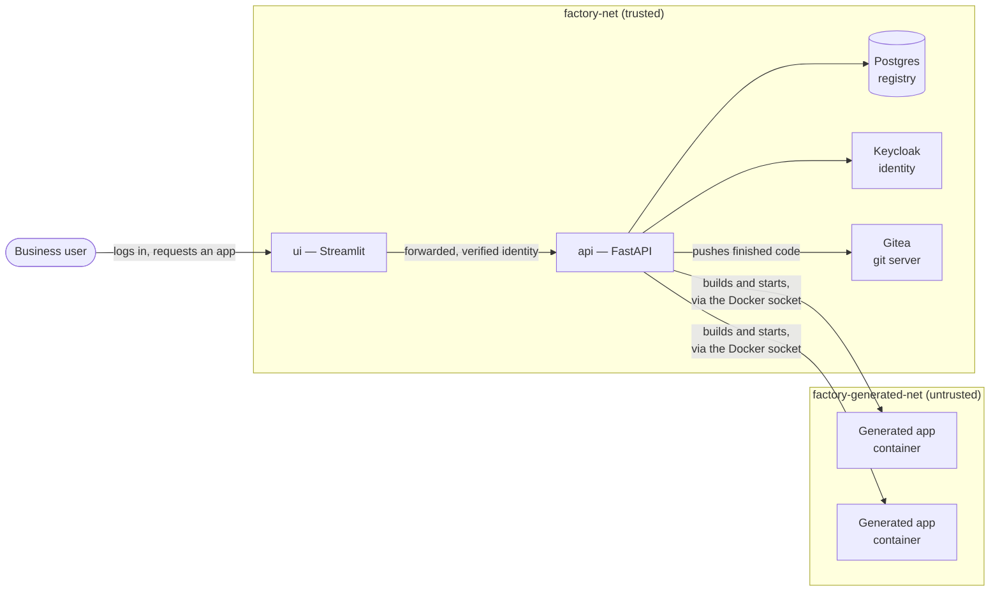
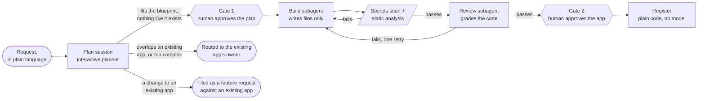

# App Factory

## What this is

This is a very early version of an internal app factory. It gives non-technical users a way to design, build, and eventually operate applications supported and enabled by IT folks with the support of AI. Someone describes what they need in plain language, an interactive planner works through the requirements with them, and the factory builds and deploys it from an architectural pattern that IT already supports. A person approves the plan before anything is built, and approves the finished app before it is registered.

It also catalogs and registers internal apps built by the business using AI. Every app gets a real owner, a description of what it does, and a record of what was spent building it. When a new request overlaps something that already exists, the planner routes the requester to the person who owns it instead of producing a second copy. When someone wants a change to an app that already exists, it is filed against that app rather than becoming a new one.

The applications it produces are deliberately simple, and the blueprints it builds from come from IT rather than from the factory itself. The value is in the process and the record, not in the sophistication of what gets generated. Though the longer term design intent is for the factory and blueprints to support slightly more complicated applications and concepts to better support the needs of the business.

It runs locally for now since this is a proof of concept, but it supports the full flow of helping a user design, build, and deploy a simple internal application.

## Why build this?
Generally speaking organizations as they grow slowly accumulate internal tools that have been built to achieve a specific use that sometimes become key parts of how teams do their jobs. Especially with the ongoing increase in AI usage the number of these tools has started to accelerate and as a result more internal tools without basic information of what they are, who owns them, what value or capability they provide the business, and what they cost to build and operate are becoming increasingly important and showing up in more places than previously expected. 

This tool seeks to fill those gaps by serving as both the platform thats used to build these internal apps but also manage their lifecycle (for now creation and changes), provide IT and technology organizations the ability to review those applications as they are built, as well as track their ownership and cost to build.

## Architecture

Two different pictures answer two different questions: what infrastructure runs the whole
platform, and what happens to one request as it moves through the factory.

### The platform



Five services, two Docker networks. `api` is the only service on both — it builds and starts each
generated app's container over the Docker socket, and it's the only bridge between the trusted
infrastructure and the untrusted generated apps. A generated app has no network route to Postgres
or Keycloak at all, enforced by which network its container sits on, not by a setting inside the
app itself.

### The pipeline



Every request ends in one of three outcomes: it gets built, it's routed to whoever already owns
something like it, or it's filed against an app that already exists. Only the first outcome reaches
Build and Review. Both gates are real decisions, not formalities — Gate 1 is before a build spends
money, Gate 2 is before anything is permanently recorded.

### How this stays reliable

Reliability here doesn't come from careful prompting. It comes from moving checks out of the
model's judgment and into code that runs before the model acts, plus a human decision at the two
points where a mistake would be expensive or hard to undo.

- Every file Build writes is checked in code against the app's own directory — not a prompt
  instruction, a permission check the model can't talk its way around.
- Every generated app is scanned by gitleaks, a check for this system's own live API key, and
  bandit/ruff's security rules — all before Review ever reads the code. A high-severity result
  from any of them stops the pipeline outright.
- The planner never relies on a single lookup call to catch duplicates. It's given the full list
  of registered apps, capabilities, and owners as text, with an explicit warning that no match on
  a lookup doesn't mean no duplicate.
- Free text the model has to repeat back is exactly where it invents things — during testing it
  hallucinated a blueprint id and once named a user by plain username instead of their real
  account id. Both are now handled in code instead: the blueprint id is filled in by the
  orchestrator and never asked of the model, and any named owner is checked against the app's real
  owners and swapped for a real one if it doesn't match.
- Approving the plan and approving the finished app are two separate decisions, not one — a bad
  plan can be stopped before it spends money, and a working app can still be stopped before it's
  permanently recorded.
- The planner stops after 8 exchanges. Build and Review get one retry before reporting a clear
  failure. A numeric complexity limit routes anything too large to a person instead of building it.
- Generated containers run on a network with no route to Postgres or Keycloak, and an automated
  test confirms that from inside a real container rather than trusting the config alone. The Claude
  Agent SDK runs with settings that stop it from picking up a developer's own local tool
  configuration — an early bug let it do exactly that, at real cost (see the cost log below). Every
  API request is checked against a real login token.
- Every stage was actually run against the real thing, not a stand-in: a real Postgres, a real
  Keycloak login, a real Claude Agent SDK call, a real Docker build, a two-person feature-request
  walkthrough. Several of the bugs below — a git ownership error, a network gap, an
  owner-validation gap — were only found this way.

## Getting it running

Docker is the only requirement on your machine — no local Python or `uv` install needed:

```
cp .env.example .env    # fill in ANTHROPIC_API_KEY, the one thing nothing can do for you
make up
```

That single command builds and starts every service, creates the Gitea account and token, and
loads the schema and seed data. First run takes a few minutes (building images); re-running it
just confirms everything's already in place.

When it finishes, you'll see:

- UI: http://localhost:8501 (log in as `alice`/`alice`, `bob`/`bob`, `carol`/`carol`, or
  `dave`/`dave` — see `keycloak/realm-export.json`)
- API: http://localhost:8000/health
- Keycloak admin console: http://auth.localhost:8080 (`admin`/`admin`)
- Gitea: http://localhost:3000 (`factory` / whatever `GITEA_PASSWORD` you set, default
  `factory-dev-password`)

If your browser doesn't resolve `auth.localhost` to `127.0.0.1` on its own (most do, since
`.localhost` is reserved to always mean the local machine), add `127.0.0.1 auth.localhost` to
your hosts file.

What `make up` does, step by step (`scripts/bootstrap.sh`):
1. Copies `.env.example`/`.streamlit/secrets.toml.example` if they don't exist yet, and stops with
   a clear message if `ANTHROPIC_API_KEY` still looks like the placeholder.
2. `docker compose up -d --build` — starts Postgres, Keycloak, Gitea, `api`, and `ui`.
3. Waits for Gitea, then creates the `factory` service account, mints an access token, and writes
   it into `.env` as `GITEA_TOKEN` — generating it needs Gitea already running, which is why it
   can't just be a required setting up front like `ANTHROPIC_API_KEY`.
4. Restarts `api` so it picks up the new token.
5. Runs `alembic upgrade head` and the registry seed loader inside the `api` container, so nothing
   on the host needs Python or `uv` at all.

## Identity and login

Keycloak runs as a container with a small realm meant only for this project
(`keycloak/realm-export.json`, fixture users only — each password matches its username).
Streamlit's built-in login (`st.login`) is the identity provider; `app_owners.keycloak_sub` stores
the real, verified subject identifier from that login.

`KC_HOSTNAME=auth.localhost` makes the browser and the `ui` container reach Keycloak at the same
address — without it, the browser sees `localhost:8080` and `ui` sees `keycloak:8080`, and
different addresses fail login verification. `ui` resolves `auth.localhost` back to the host via
Docker's `host-gateway`.

`factory/api/auth.py` checks a real Keycloak token on every `/plans*` and `/builds*` request —
signature against Keycloak's public keys, issuer and client checked, identity taken from the
verified token rather than anything the caller supplies. Every endpoint also checks that a run
belongs to the verified caller. The UI sends this token as `Authorization: Bearer <token>`; the
eval scripts log in as real fixture users the same way (`evals/keycloak_auth.py`) rather than
bypassing the check.

## Planning a new app

`factory/agents/plan_session.py` calls the real Claude Agent SDK, which runs the actual Node-based
`claude` CLI as a subprocess — the `api` image installs Node and `@anthropic-ai/claude-code` for
this. It's configured not to read a developer's own local config (`setting_sources=[]`,
`strict_mcp_config=True`). **Only ever run or test this SDK inside a container** — never with a
personal API key on a dev machine.

Requires `ANTHROPIC_API_KEY` in `.env` (real, billed calls). The 8-turn planner limit is enforced
by this project's own code (`Run.turns_used`), separately from the SDK's own per-connection limit,
since each HTTP request starts a new SDK connection resuming the same session.

## Building and reviewing

`factory/agents/build_session.py` only writes files — it has no shell access and no network
access, and every file write is checked against the app's own directory before it's allowed.
Starting the container is ordinary code (`container_runtime.py`, using `docker-py`), never
something the model does directly.

The order is fixed in code: Build writes files, then a required-files check, a secrets scan
(gitleaks plus a check for this system's own API key), and static analysis (bandit/ruff, only
high-severity results block) all run, then Review — and only after Review passes does anything get
committed, built, run as a container, or pushed to Gitea. One retry is allowed before a run is
marked failed, findings recorded.

The `api` container runs as root (needed for Docker socket access), so generated files are chowned
to `HOST_UID`/`HOST_GID` (default `1000`/`1000`) once an attempt's outcome is known — after the git
operations, not before, since git itself runs as root and refuses to touch a repo it doesn't own.

`generated_apps/<slug>` is the real, inspectable working tree Docker builds from and Build writes
into; the permanent copy a person would clone lives in Gitea (`factory/agents/gitea_client.py`).
The push happens last, only after the container builds and starts, not right after the commit —
pushing earlier meant a retry (starting from clean git history) could push unrelated history onto
a repo Gitea already had a commit on and get rejected before Build even had a chance to fix the
real failure. It creates the repo if needed, then pushes over HTTP with a token used once and
never written to the repo's own config or shown in an error.

Generated containers run on `factory-generated-net`, with no route to Postgres or Keycloak; only
`api` sits on both networks. `make eval-build` checks this directly from inside a running generated
container — this exists because the network config was wrong once (see "Where a mistake was made,
and how it was caught" below).

## Registering the finished app

The second approval (`POST /builds/{id}/approve`) is the only place an `App` row gets created —
plain code (`factory/registry/register.py`), not the model. It creates the app, an `AppOwner`
(the requester, as `business` owner), a `Capability` per declared capability, and stamps the plan
and build/review runs with the new app's id.

## Picking up a feature request

An owner sees open requests against their apps at `GET /feature-requests`. Picking one up starts a
normal Plan session with the request's description as the opening message and `Run.app_id` set to
the target app — that one field is the only signal Build, Review, and Register need to modify the
existing app instead of building a new one. A failed retry discards its changes with `git
checkout`/`git clean`, never by deleting the directory. Register adds the capability to the
existing app and marks the request resolved.

Known gap, not yet fixed: if the pipeline fails after the first approval has already been recorded,
the plan is left in an approved-but-unbuilt state with no way to retry it through the API — this
needs either a way to safely repeat the approval or a separate retry action.

## Running the evaluations

These call a real model and cost real money — run them deliberately, never as part of
`make test`:

```
make eval-routing    # 3 cases, one per Plan outcome
make eval-review     # 2 fixtures: a hardcoded secret, an injection risk
make eval-build      # one full plan through the pipeline, plus the network isolation check
```

All three run inside the `api` container. `evals/routing_cases.yaml` holds a small set of cases;
adding more is mechanical. Each case uses a `ScriptedRequester` — canned answers matched by keyword
— to answer the planner's questions automatically. `run_build_eval.py` runs the real pipeline
start to finish and removes its own container, image, Gitea repository, generated directory, and
database rows afterward, whether it passed or failed.

## Developing on this project

```
uv sync
uv run ruff format .
uv run ruff check .
uv run pytest
```

Requires [`gitleaks`](https://github.com/gitleaks/gitleaks) on your `PATH` (a single binary with
no other dependencies) — `factory/agents/secrets_scanner.py`'s tests call the real program rather
than a stand-in, matching the version installed in `Dockerfile.api`:

```
curl -sSL https://github.com/gitleaks/gitleaks/releases/download/v8.30.1/gitleaks_8.30.1_linux_x64.tar.gz \
  | tar -xz -C ~/.local/bin gitleaks   # or any directory already on PATH
```

`bandit` and `ruff` are regular dependencies (`uv sync` installs both) — `ruff` is a main
dependency, not dev-only, because Review calls its security rules as part of the running system.

## What to build next

- Step this up from being a POC to an actual platform/service
  - Make this deployable (most likely onto AWS or another cloud platform)
  - Rebuild the frontend, I want to move to using nextjs
- Build additional blueprints and options for applications
  - New deployment destinations (deploy into K8s clusters, ECS, etc.)
  - Providing the ability to build blueprint elements using for example TF Modules or Helm chart templates
- Expand the complexity of the registry
  - Track deployed infrastructure spend
- Add in an operations agent to the factory to monitor deployed applications and notify technical and business owners of outages as well as take initial steps to recover applications from simple failures
- Build solid documentation functionality for built applications that is indexable and usable by the app factory agents themselves as well as users

## Decisions, mistakes, and cost

### Key decisions

| Decision                        | Choice                                                                                                                                        | What was considered and rejected, and why                                                                                                                                                                                                                                                                                                                                                                                                                                  |
| ------------------------------- | --------------------------------------------------------------------------------------------------------------------------------------------- | -------------------------------------------------------------------------------------------------------------------------------------------------------------------------------------------------------------------------------------------------------------------------------------------------------------------------------------------------------------------------------------------------------------------------------------------------------------------------- |
| Registry storage                | Postgres, with the raw plan stored as a `jsonb` column and capabilities/owners stored as their own rows                                       | Storing everything only as `jsonb` with no separate rows — rejected because duplicate detection and scope comparison need to be plain, indexable queries, not searches through a JSON document, to stay predictable and testable.                                                                                                                                                                                                                                          |
| Identity                        | A real Keycloak container and realm, using Streamlit's built-in login                                                                         | A selector that lets a user pick who they're pretending to be, with no real login — rejected in favor of a real, verifiable identity, since naming a specific owner only means something if that identity is real.                                                                                                                                                                                                                                                         |
| Blueprint scope limit           | A numeric complexity score from 1 to 5, with a written description and worked examples for each level, given to the planner as reference text | A bare number with nothing explaining what it means — rejected as too likely to be scored inconsistently between runs with nothing to check it against.                                                                                                                                                                                                                                                                                                                    |
| Build/Review structure          | Two separate Claude Agent SDK sessions (Build, then Review), controlled by this project's own code                                            | One SDK session with Build and Review as subagents inside it — this was the original plan; changed on request, because turn limits and per-stage cost tracking are simpler to implement as code controlling two sessions than as the SDK's own subagent handling.                                                                                                                                                                                                          |
| Secrets scanning                | gitleaks, plus a separate check for the literal value of this system's own live API key                                                       | Regular expressions written by hand for this project (the first version — correctly pointed out as redoing work a maintained tool already does well); detect-secrets (a Python library with no way to check whether a found value is a real, currently valid credential); TruffleHog (checks whether a found credential is currently valid, which doesn't help here, since a generated app should never contain a real credential regardless of whether it's still valid). |
| Static analysis in Review       | bandit and ruff's security rules, where a high-severity result blocks the pipeline                                                            | Review done only by the model reading the code (the first version — correctly pointed out as an easy shortcut, since a maintained tool exists for exactly this and the model alone missed a category of problems a fixed tool catches every time).                                                                                                                                                                                                                         |
| Where generated apps are stored | Gitea (a self-hosted git server); local disk is only the working copy Build writes into and Docker builds from                                | Local disk as the only copy (the first version) — changed because a directory on the host isn't a real way for a person to clone, push, and control access to the code; a real git server is.                                                                                                                                                                                                                                                                              |
| Python version                  | 3.13, used everywhere (this project's own images and the generated apps' images)                                                              | 3.12 (the original choice) — there was no actual reason to prefer 3.12; it was simply the first version picked, without being asked.                                                                                                                                                                                                                                                                                                                                       |
| Cost tracking                   | A separate record for each stage and each model used, attached to the app once it's registered                                                | One combined number per run — rejected because it hides which stage is expensive, which is the useful part of tracking cost at all.                                                                                                                                                                                                                                                                                                                                        |

### Where a mistake was made, and how it was caught

- An early version's docs described the API accepting a caller's claimed identity unchecked,
  calling it an acceptable POC limitation — written by me, unchecked, then treated as settled fact
  later on. A security review found this made every endpoint exploitable: anyone who could reach
  the API could claim to be any user and trigger real builds. The real problem was a decision and
  its justification written by the same unchecked process, with no check in between. Fixed with
  real token verification on every request.
- Asked to put a real API key into `.env`, I used a shell command instead of the file-editing tool
  to avoid printing the key — which backfired, since this tool's file-change detection echoes the
  full contents of anything changed outside its own editing tools. Caught immediately; the fixed
  rule now is that a real secret only ever goes in through the editing tool, never a shell command.
  (The key itself never left this machine or the provider that already holds it, so the exposure
  was limited to local session records — but it couldn't be rotated afterward, which is exactly
  what the rule now prevents.)
- Early Plan-session testing ran from my own dev session instead of a container, so the SDK's
  subprocess inherited every tool, skill, and plugin configured there — about 15,800 tokens and
  real money on one one-word test. Caught via a leftover running process; fixed with a standing
  rule that this SDK only ever runs in a container.
- A manual review after an early working pipeline found a batch of decisions shipped without being
  asked about first: no automated test for the network config change, plain disk instead of a real
  git server, an unconsidered Python version, model-only review with no separate tool, a redundant
  naming convention, and comments written as quoted strings instead of plain comments. None hidden,
  none raised for a decision either — all fixed in one pass, most asked about first this time.
- The check for whether a named owner is real accepted anything already present in the owner
  records — including old test rows from before real login-based identity existed. Testing turned
  up a case where one such stale row let a wrong answer pass as real, with no one pointing it out.
  Fixed by requiring an owner value to actually look like a verified identity, not just be present
  in the table.

### Cost log

Money was spent in two places against the same API key — they need to be counted separately before
they can be added together.

The factory's own model calls — planning, building, reviewing generated apps — are recorded in
`cost_events` per call, so these figures are exact, not estimated:
- One plan-build-review cycle for a small app: typically **$0.15 to $0.35**, split across
  planning, build, and review — each stage uses a cheaper model for small sub-requests and a
  larger one for the main work.
- Picking up a feature request costs about the same again — it's a full second cycle.
- The environment-isolation bug cost **$0.0637 for a single one-word test** — 8 to 10x normal, and
  the clearest example of the same problem being both a reliability and a cost issue.
- `make eval-routing` ≈ **$0.15–$0.25**. `make eval-build` ≈ **$0.15–$0.35**. `make eval-review` is
  a few cents.
- All of that together — every real check made while building this, every eval run, every re-run
  after a bug fix — comes to roughly **$3 to $6**. One real request, start to finish, costs well
  under a dollar.

Building the factory itself is the other side of it: for most of this project's build time, the
assistant writing the code ran against the same API key, so that counts toward the same total.
None of it is recorded as a dollar figure — it's reconstructed from raw per-message token counts
across every session and sub-agent from both build days (2026-08-24, 2026-08-25), de-duplicated
for repeated streamed messages, then priced per model:

| Model      | Role                                        | Calls | Cost   |
| ---------- | -------------------------------------------- | ----- | ------ |
| Sonnet 5   | main coding work                             | 1,270 | ~$153  |
| Opus 4.7   | planning sessions and background subagents   | 154   | ~$11   |
| Opus 5     | main coding work (small slice)               | 21    | ~$2    |
| Fable 5    | advisor consultations                        | 3     | ~$9    |
| Opus 5     | advisor consultations                        | 1     | ~$0.30 |
| Sonnet 4.5 | legacy, negligible                           | 9     | ~$0.20 |

That comes to **roughly $176**. Almost all of it is Sonnet 5 cache reads — a long session re-sends
a lot of accumulated context, and even at a steep cache discount that volume adds up. This figure
grows with every further turn spent on this project — last reconstructed after the wording pass
that tightened this README.

Combined, the total cost against this key for the whole engagement is roughly **$179 to $182** —
overwhelmingly the coding work itself, not the system it produced. Expected for a project worked
interactively over two days, but worth being explicit: the "$3 to $6" figure is what this system
costs to *operate*, a small fraction of what it cost to *build*.

What would reduce this cost further:
- The planner's registered-apps/blueprint text is rebuilt and resent every turn. Keeping it
  identical across turns — and conversations, until the registry changes — would let prompt
  caching cover more of the request.
- Build allows up to 30 internal turns for four files. A tighter cap costs nothing in practice and
  caps the worst case.
- `eval-routing`, `eval-review`, and `eval-build` each start a fresh connection today; running them
  back to back would carry caching over between them.
- The single most expensive mistake here was an environment config problem, not a prompting one —
  a check that fails loudly if the SDK's isolation settings are missing would catch the next one
  before it costs money.
- On the coding-session side, almost all ~505 million input tokens were cache reads — the caching
  working as intended, not waste — but the volume itself points at the real lever: fewer, more
  targeted file reads and shorter agent turns per milestone. Scoping work into smaller, separable
  sessions would be the single highest-leverage change.
